# TradePulse Architecture & Dataflow

This document provides visual diagrams and descriptions of the TradePulse architecture.

## System Architecture

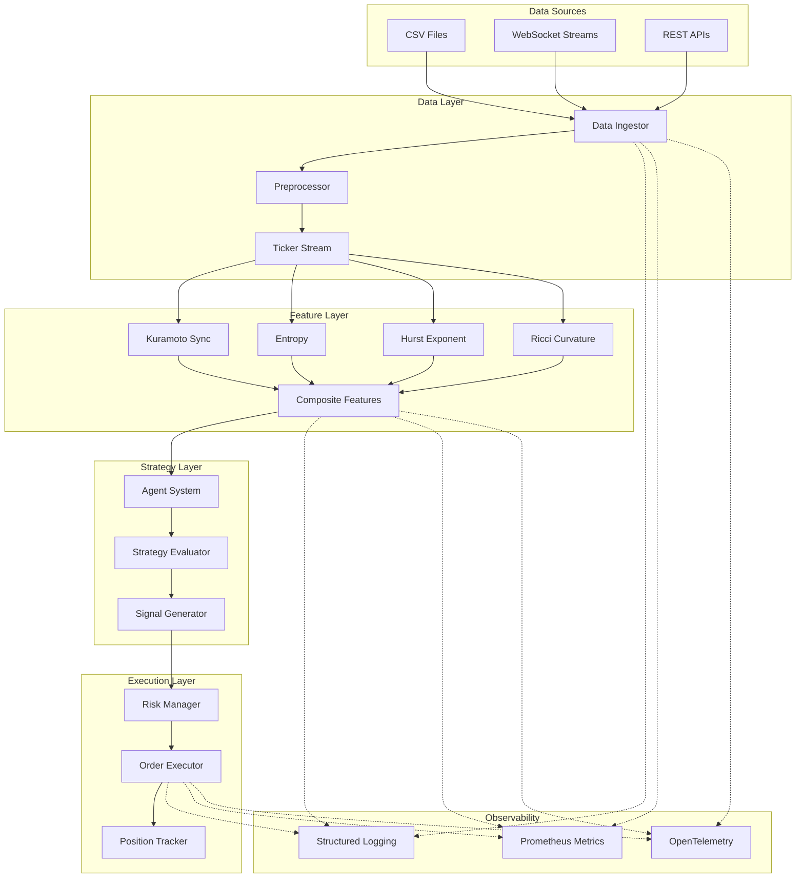

## Data Flow

### 1. Data Ingestion Pipeline

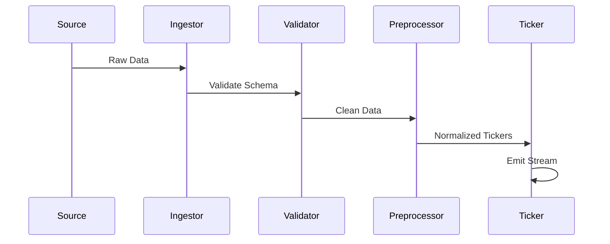

### 2. Feature Computation Pipeline

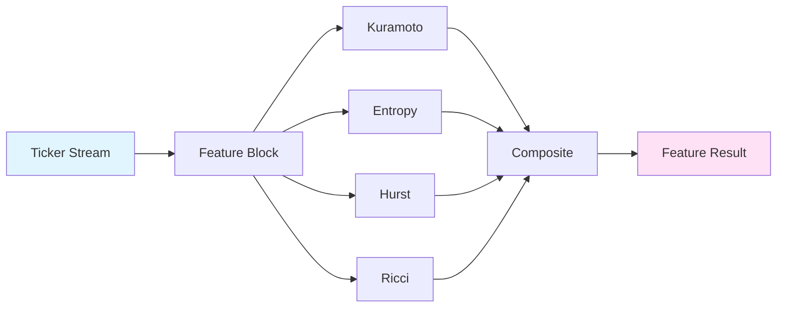

### 3. Backtest Execution Flow

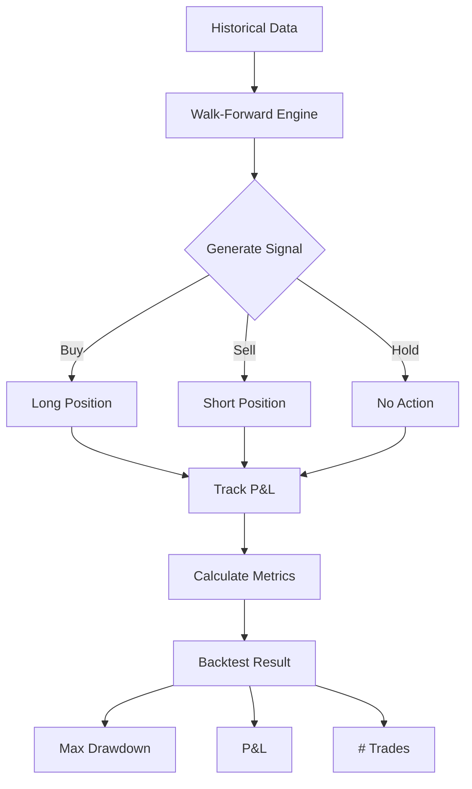

### 4. Agent Optimization Loop

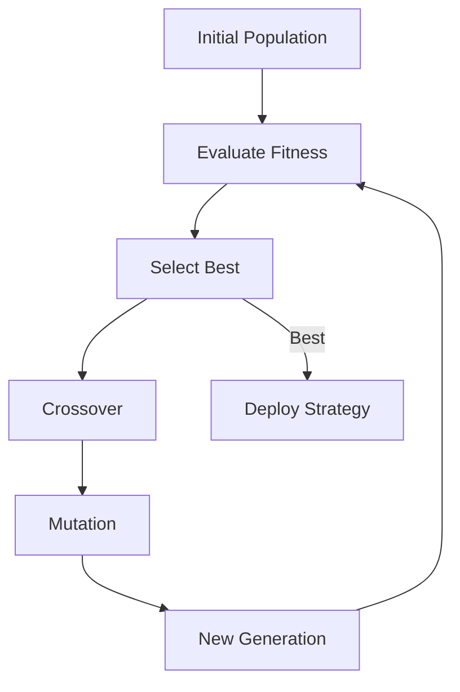

## Module Dependencies

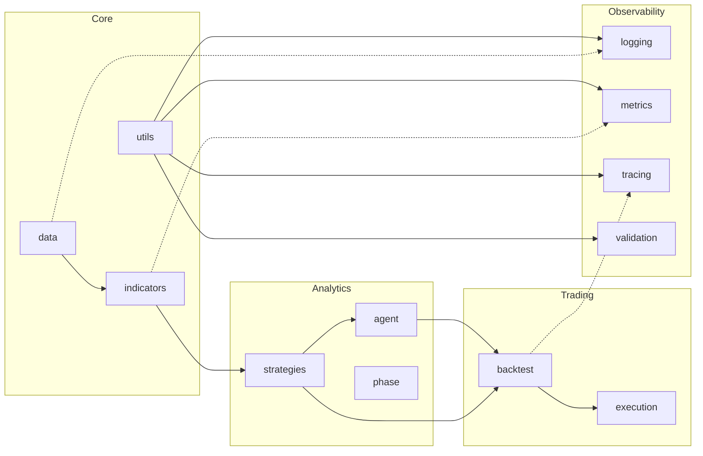

## Observability Stack

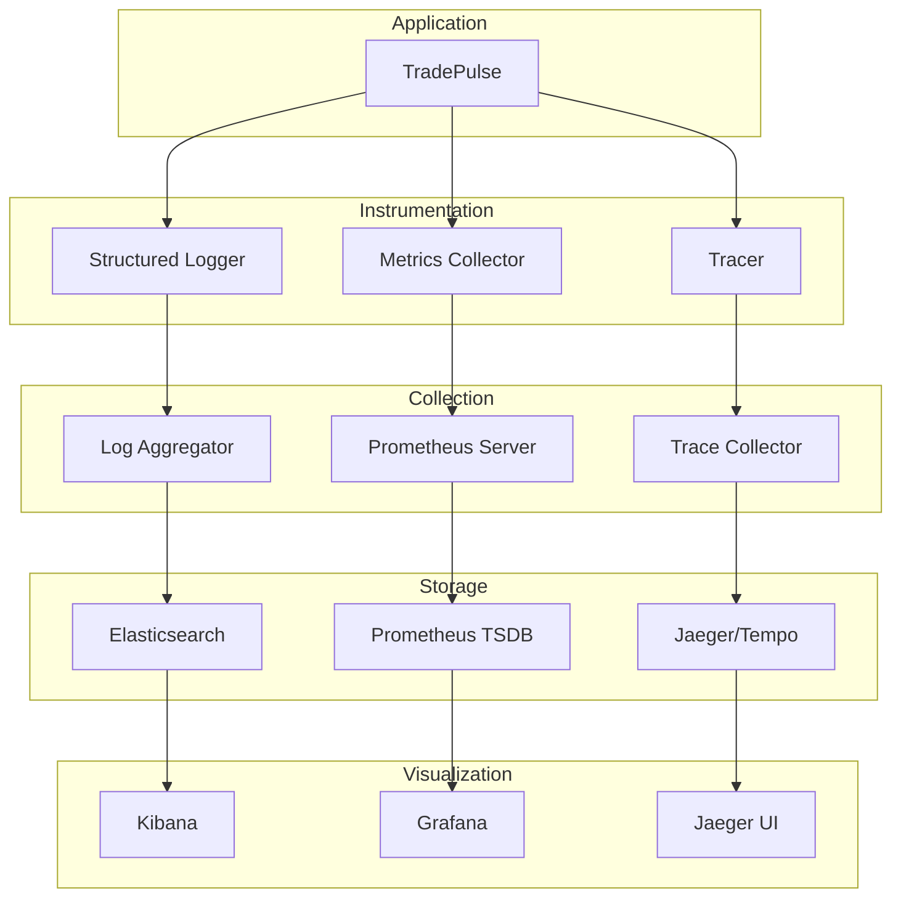

## Deployment Architecture

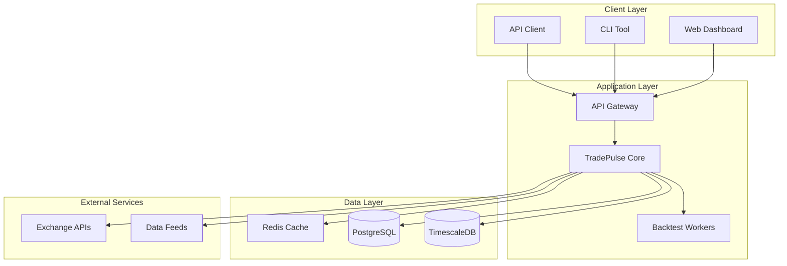

## Security Architecture

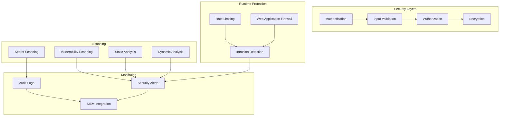

## Testing Architecture

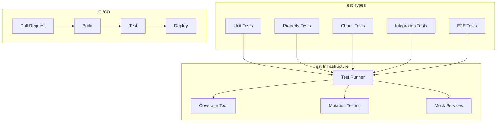

## Performance Optimization

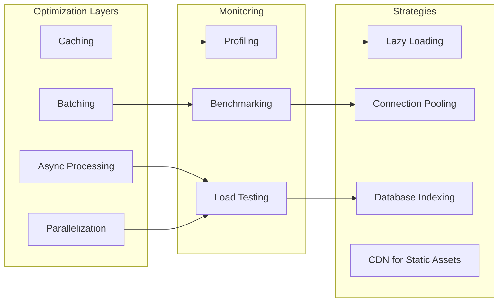

## Key Design Principles

### 1. Separation of Concerns
- **Data Layer**: Handles data ingestion and normalization
- **Feature Layer**: Computes mathematical indicators
- **Strategy Layer**: Generates trading signals
- **Execution Layer**: Manages orders and positions
- **Observability Layer**: Provides monitoring and tracing

### 2. Plug-and-Play Architecture
- All components implement standard interfaces
- Easy to add new indicators, strategies, or data sources
- Modular design enables independent testing and deployment

### 3. Observability First
- All operations are instrumented with metrics
- Structured logging with correlation IDs
- Distributed tracing for end-to-end visibility

### 4. Security by Design
- Input validation at all boundaries
- Secret scanning in CI/CD
- Runtime validation with Pydantic
- Audit trails for all critical operations

### 5. Test-Driven Development
- 314+ comprehensive tests
- Property-based and chaos testing
- Mutation testing for test effectiveness
- 96.91% coverage on critical modules

## Related Documentation

- [Testing Guide](../TESTING.md)
- [Contributing Guidelines](../CONTRIBUTING.md)
- [Advanced Testing & Observability](advanced-testing-observability.md)
- [Security Policy](../SECURITY.md)
