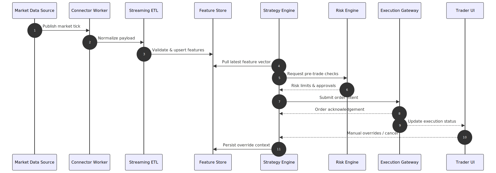

# TradePulse Architecture Overview

This page outlines the core TradePulse architecture through contextual, interaction, and data flow diagrams to support onboarding and operational planning.

## System Context

TradePulse combines ingestion pipelines, a unified data platform, analytics services, and delivery channels for traders, quants, and downstream systems.

<figure markdown>
{ width="960" }
<figcaption>System context showing how external data sources flow through ingestion into the unified platform, where analytics services deliver insights to multiple experience channels.</figcaption>
</figure>

The underlying Mermaid source is available at [`assets/system_overview.mmd`](assets/system_overview.mmd) for version-controlled updates.

## Component Interactions

<figure markdown>
{ width="960" }
<figcaption>Sequence of interactions for delivering market data, generating strategy signals, and closing the feedback loop with manual trader input.</figcaption>
</figure>

The diagram source is stored alongside the rendered asset at [`assets/service_interactions.mmd`](assets/service_interactions.mmd).

## Data Flow and Governance

<figure markdown>
{ width="960" }
<figcaption>Data lifecycle illustrating how governance checkpoints maintain quality from ingestion through production trading and monitoring.</figcaption>
</figure>

The Mermaid definition can be edited in [`assets/data_flow.mmd`](assets/data_flow.mmd) and re-rendered with the documentation toolchain.

## Related Documentation

- [Feature Store Architecture](feature_store.md)
- [Operational Readiness](../operational_readiness_runbooks.md)
- [Deployment Guide](../deployment.md)
- [Production Security Architecture](../security/architecture.md)

