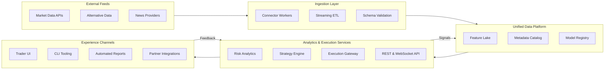
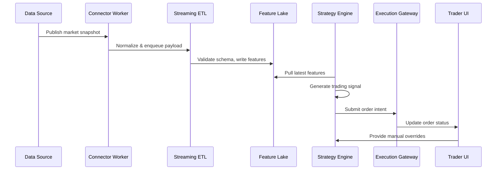
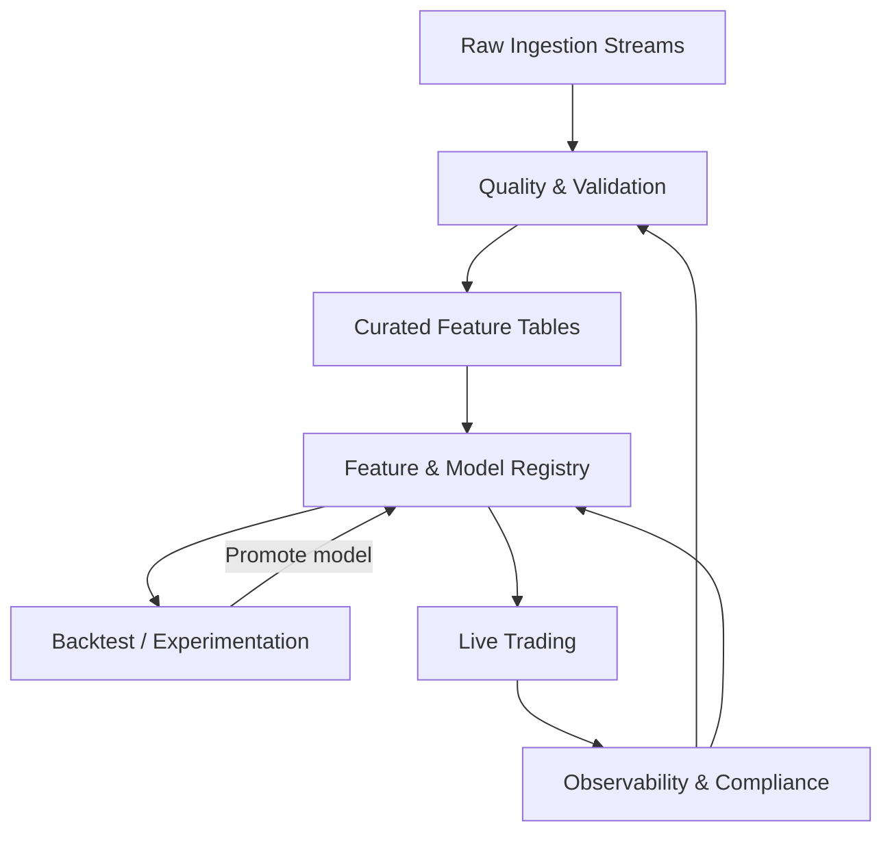

# TradePulse Architecture Overview

This page outlines the core TradePulse architecture through contextual, interaction, and data flow diagrams to support onboarding and operational planning.

## System Context

TradePulse combines ingestion pipelines, a unified data platform, analytics services, and delivery channels for traders, quants, and downstream systems.

<figure markdown>

<figcaption>System context showing how external data sources flow through ingestion into the unified platform, where analytics services deliver insights to multiple experience channels.</figcaption>
</figure>

## Component Interactions

<figure markdown>

<figcaption>Sequence of interactions for delivering market data, generating strategy signals, and closing the feedback loop with manual trader input.</figcaption>
</figure>

## Data Flow and Governance

<figure markdown>

<figcaption>Data lifecycle illustrating how governance checkpoints maintain quality from ingestion through production trading and monitoring.</figcaption>
</figure>

## Related Documentation

- [Feature Store Architecture](feature_store.md)
- [Operational Readiness](../operational_readiness_runbooks.md)
- [Deployment Guide](../deployment.md)

