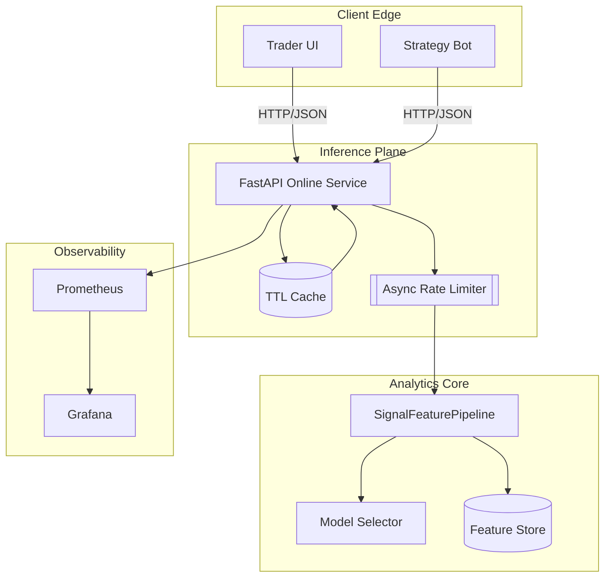
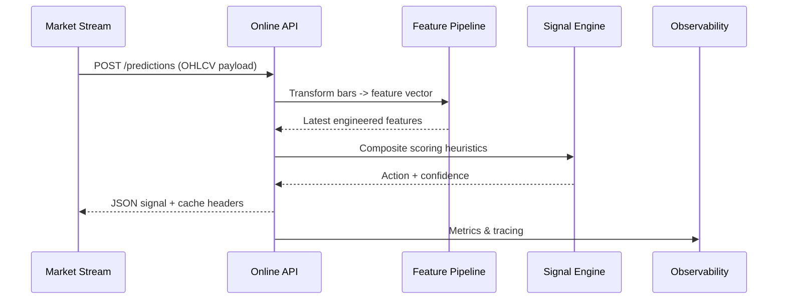

# TradePulse Product README

This document condenses the essential workflows and diagrams required to launch TradePulse in a production-like environment. It complements the technical README by focusing on product enablement: how to stand up services quickly, unlock end-to-end signals, and understand the architectural guardrails.

---

## 🚀 QuickStart

### Python (pip) workflow

```bash
# 1. Bootstrap an isolated environment
python -m venv .venv
source .venv/bin/activate  # Windows: .venv\Scripts\activate

# 2. Install runtime dependencies
pip install -r requirements.lock

# 3. Install optional extras as needed
pip install .[connectors]   # Broker & market adapters
pip install .[feature_store]  # Arrow/Polars feature registry
```

### High-performance setup with `uv`

[`uv`](https://github.com/astral-sh/uv) dramatically speeds up environment creation and caching.

```bash
# 1. Create & activate the environment
uv venv
source .venv/bin/activate

# 2. Sync dependencies from the lock file (respecting hashes)
uv pip sync requirements.lock

# 3. Install TradePulse in editable mode for local development
uv pip install -e .[dev]
```

### Docker Compose deployment

```bash
# Build and start core services (API, monitoring, worker pool)
docker compose up -d tradepulse-api grafana scheduler

# Follow logs for the inference API
docker compose logs -f tradepulse-api

# Shut everything down cleanly
docker compose down
```

> **Tip:** GPU-accelerated images are available via the `docker-compose.gpu.yml` override. Append `-f docker-compose.gpu.yml` to the commands above when targeting CUDA hosts.

---

## 🧪 From zero to signal – operational recipe

| Step | Goal | Commands/Artifacts |
| --- | --- | --- |
| 1 | Bootstrap environment | `uv pip sync requirements.lock` or `pip install -r requirements.lock` |
| 2 | Fetch historical bars | `python tools/data/download_bars.py --symbol BTC-USD --days 7` |
| 3 | Materialise features | `python tools/features/build_matrix.py --symbol BTC-USD --source data/bars` |
| 4 | Train offline model | `python analytics/signals/train.py --config configs/signals/default.yaml` |
| 5 | Validate strategy | `python -m pytest tests/integration/test_signal_walkforward.py` |
| 6 | Launch online API | `uvicorn application.api.service:app --host 0.0.0.0 --port 8000` |
| 7 | Request predictions | `curl -X POST http://localhost:8000/predictions -d @payload.json -H "Content-Type: application/json"` |

The new FastAPI microservice reuses the feature pipeline from `analytics.signals.pipeline` and publishes OpenAPI documentation at `/docs`. Cached responses keep repeated downstream queries fast while `AsyncLimiter` protects upstream data sources via token-bucket rate limiting.

---

## 🏗️ Architecture schematics

### Core runtime topology



### Data lifecycle



---

## 📑 Reference materials

- **OpenAPI schema:** Generated at runtime via `GET /openapi.json`.
- **Postman collection:** `docs/schemas/tradepulse_api.postman_collection.json` (auto-updated via CI).
- **Operational runbooks:** `docs/runbook_live_trading.md` and `docs/runbook_data_incident.md`.
- **Monitoring:** Grafana dashboards under `docs/monitoring.md`.

For advanced workflows—federated feature stores, GPU inference, or cross-language orchestration—consult the whitepapers in `docs/architecture/` and the ADRs in `docs/adr/`.
